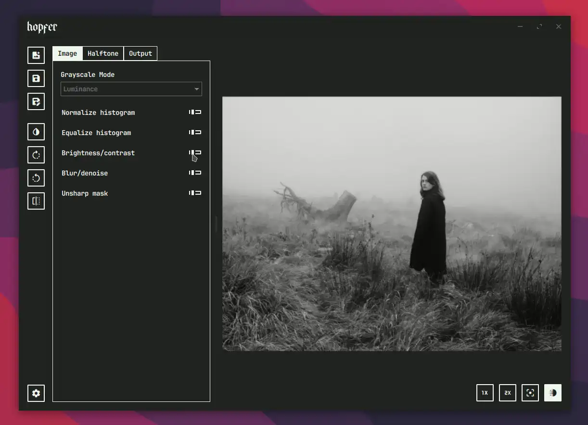

<p align="center">
  
</p>

<h1 align="center">A Python GUI for halftoning</h1>

<p align="center">
<b>hopfer</b> is a Python-based GUI application that implements a wide range of halftoning algorithms from scratch primarily meant for printmaking purposes.
</p>

---

<p align="center">
    
</p>


## Table of contents

* [Introduction](#introduction)
* [Features](#features)
* [Requirements](#requirements)
* [Installation](#installation)

## Introduction

**hopfer** is a digital halftoning tool built with Qt6 for the GUI, while leveraging NumPy and Numba for high-performance halftoning.

Originally developed as part of my PhD research on digital halftoning for analog printmaking techniques, **hopfer** is designed primarily for this purpose. While it may have applications in image compression and visual effects, these are not its main focus.

At present, **hopfer** does not support palette-based halftoning or multi-level dithering, and there are no plans to add these features.
## Features

- A variety of **halftoning algorithms**, including:
  - Fixed threshold
  - Local thresholds
  - Random dithering
  - Bayer dithering
  - Clustered dot halftoning
  - Error diffusion dithering
  - Variable error diffusion dithering
- **Basic non-destructive image editing tools**, such as:
  - Rotation
  - Brightness & contrast
  - Gaussian blurring
  - Denoising
  - Sharpening
- **Support for a wide range of image formats**, including:
  - PNG, JPEG, BMP, TIFF, WebP and more (anything supported by [OpenCV](https://docs.opencv.org/3.4/d4/da8/group__imgcodecs.html))

## Requirements

Not sure yet.

## Installation

### 1. Clone the repository

```bash
git clone https://github.com/crunchpaste/hopfer
```

### 2. Navigate to the project directory

```bash
cd hopfer
```

### 3. Install the dependencies (preferably in a venv)

```bash
pip install -r requirements.txt
```

### 4. Run it

```bash
python src/hopfer.py
```

### Optional: Compile to a static binary

Despite depending on *numba* you can still compile **hopfer** to a single static binary using [**nuitka**](https://nuitka.net/). To do so:

#### Compile all numba functions to a static binary

```bash
python src/algorithm_compiler.py
```

#### Install *nuitka* (preferably in a venv)

```bash
pip install nuitka
```

#### Compile the whole project to a static binary.

```bash
nuitka --standalone --onefile --include-data-dir=res=res --nofollow-import-to=numba --enable-plugins=pyside6 src/hopfer.py
```


---

Enjoy halftoning!
