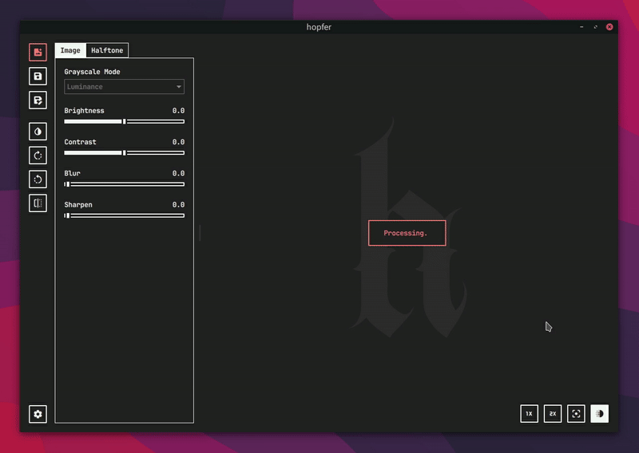

---

<p align="center">
  <picture>
    <source srcset="demo.webp" type="image/webp">
    <source srcset="demo.gif" type="image/gif">
    
  </picture>
</p>

# hopfer

**hopfer** is a Python-based GUI application that implements a wide range of halftoning algorithms from scratch, and is primarily meant for printmaking purposes.

The application uses [**Qt6**](https://doc.qt.io/qtforpython-6/index.html) for the GUI and implements the halftoning algorithms using [**NumPy**](https://numpy.org/) and [**Numba**](https://numba.pydata.org/) for much better performance.

This project was originally created as a companion to my PhD thesis on digital halftoning methods for analog printmaking techniques.

## Features

- A variety of **halftoning algorithms**, including:
  - Fixed threshold
  - Local thresholds
  - Random dithering
  - Ordered dithering
  - Error diffusion dithering
- **Basic image editing tools**, such as:
  - Rotation
  - Brightness & contrast adjustments
  - Gaussian blurring
  - Sharpening
- **Support for a wide range of image formats**, including:
  - PNG, JPEG, BMP, GIF, TIFF, WebP and more (anything supported by [Pillow](https://pillow.readthedocs.io/en/stable/))

## Requirements

Not sure yet.

## Installation

### 1. Clone the repository

```bash
git clone https://github.com/crunchpaste/hopfer
```

### 2. Navigate to the project directory

```bash
cd hopfer
```

### 3. Install the dependencies

```bash
pip install -r requirements.txt
```

### 4. Run it

```bash
python src/hopfer.py
```

### Optional: Compile to a static binary

Despite depending on *numba* you can still compile **hopfer** to a single static binary using [**nuitka**](https://nuitka.net/). To do so:

#### Compile all numba functions to a static binary

```bash
python src/algorithm_compiler.py
```

#### Install *nuitka*

```bash
pip install nuitka
```

#### Compile the whole project to a static binary.

```bash
nuitka --standalone --onefile --include-data-dir=res=res --nofollow-import-to=numba --enable-plugins=pyside6 src/hopfer.py
```


---

Enjoy halftoning!
