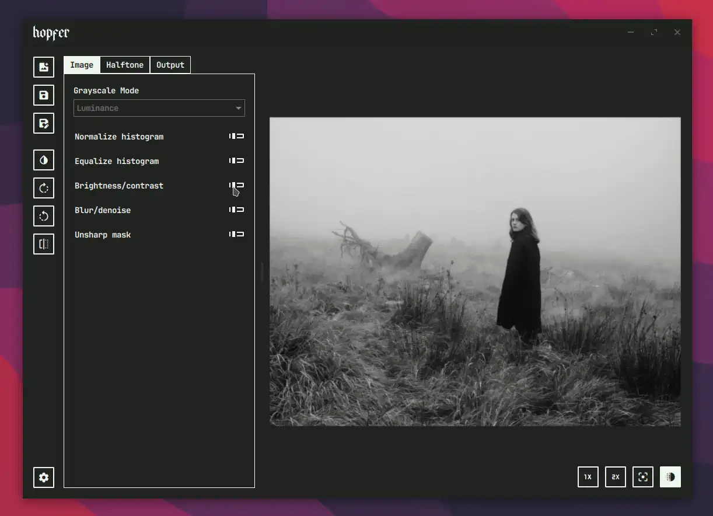

<p align="center">
  
</p>

<h1 align="center">A Python GUI for halftoning</h1>

<p align="center">
<b>hopfer</b> is a Python-based GUI application that implements a wide range of halftoning algorithms from scratch primarily meant for printmaking purposes.
</p>

---

<p align="center">
    
</p>


## Table of contents

* [Introduction](#introduction)
* [Features](#features)
* [Requirements](#requirements)
* [Installation](#installation)
* [Acknowledgments ](#acknowledgments)

## Introduction

**hopfer** is a digital halftoning tool built with QtQuick for the GUI, while leveraging NumPy and Cython for high-performance halftoning.

Originally developed as part of my PhD research on digital halftoning for analog printmaking techniques, **hopfer** is designed primarily for this purpose. While it may have applications in image compression and visual effects, these are not its main focus.

At present, **hopfer** does not support palette-based halftoning or multi-level dithering, and there are no plans to add these features.

## Features

- A variety of **halftoning algorithms**, including:
  - Fixed threshold
  - Local thresholds
  - Random dithering
  - Bayer dithering
  - Clustered dot halftoning
  - Error diffusion dithering
  - Variable error diffusion dithering
  - EDODF dithering
- **Basic non-destructive image editing tools**, such as:
  - Rotation
  - Brightness & contrast
  - Blurring
  - Denoising
  - Sharpening
- **Support for a wide range of image formats**, including:
  - PNG, JPEG, BMP, TIFF, WebP and more (anything supported by [OpenCV](https://docs.opencv.org/3.4/d4/da8/group__imgcodecs.html))

## Requirements

Not sure yet.

## Installation

### 1. Clone the repository

```bash
git clone https://github.com/crunchpaste/hopfer
```

### 2. Navigate to the project directory

```bash
cd hopfer
```

### 3. Install with pip (preferably in a venv)

```bash
pip install .
```

### 4. Run it

```bash
hopfer
```

## Acknowledgments

The project relies on the following awesome open-source libraries. I extend my thanks to their maintainers and contributors!

### Core

* **`numpy`**: [GitHub Link](https://github.com/numpy/numpy)
    > The fundamental package for scientific computing with Python.

* **`opencv-python`**: [GitHub Link](https://github.com/opencv/opencv-python)
    > Used for image processing and encoding/decoding.

* **`requests`**: [GitHub Link](https://github.com/psf/requests)
    > A simple, yet elegant, HTTP library.


### User Interface

* **`PySide6`**: [Documentation Link](https://doc.qt.io/qtforpython-6/index.html)
    > The official Python bindings for the Qt framework, used to build the GUI.

### System

* **`makeself`**: [GitHub Link](https://github.com/megastep/makeself)
    > Used for creating the Linux installer.

* **`Nuitka`**: [Website](https://nuitka.net/)
    > Used for compiling the application into an executable.

* **`platformdirs`**: [GitHub Link](https://github.com/platformdirs/platformdirs)
    > Used for determining standard, cross-platform directories for storing image and configuration data.

* **`setproctitle`**: [GitHub Link](https://github.com/dvarrazzo/py-setproctitle)
    >  Allows a process to change its title.


---

Enjoy halftoning!
